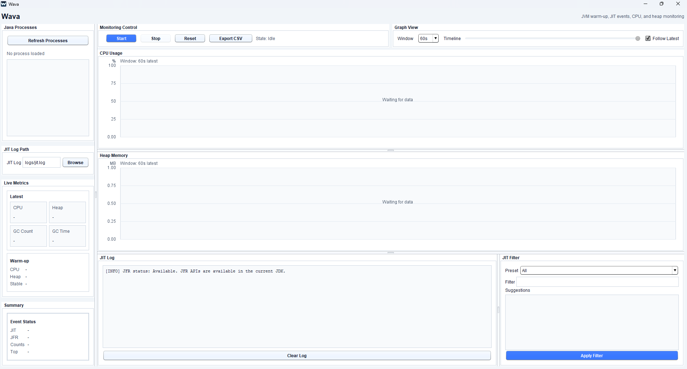

# Wava

Wava는 JVM warm-up 과정에서 발생하는 CPU 사용률, Heap 사용량, GC 변화, JIT 컴파일 로그, JFR 기록을 한 화면에서 확인하기 위한 Java Swing 기반 모니터링 도구입니다.



## 주요 기능

- 실행 중인 Java 프로세스 조회 및 선택
- 선택한 JVM의 CPU, Heap, GC 지표 실시간 수집
- CPU/Heap 그래프 표시 및 JIT, GC, Stable 마커 표시
- `-XX:+PrintCompilation` 로그 기반 JIT 이벤트 분석
- JIT 로그 필터, preset, suggestion 기능
- JFR 기록 시작/중지 및 이벤트 요약
- Warm-up 초반/후반 지표 비교 및 안정화 지점 추정
- 모니터링 결과와 JIT 이벤트 CSV 내보내기
- 시연용 sample JVM 프로세스 실행 지원

## 실행 환경

- Java 21 이상 권장
- Windows 환경 기준으로 개발 및 테스트
- `javac`, `jar`, `jpackage`가 포함된 JDK 필요
- Attach API, JMX, JFR 기능을 사용하므로 단순 JRE가 아닌 JDK에서 실행하는 것을 권장

## 소스에서 실행하기

프로젝트 루트에서 Java 소스 파일을 컴파일합니다.

```powershell
New-Item -ItemType Directory -Force out | Out-Null
Get-ChildItem src\main\java -Recurse -Filter *.java |
    Sort-Object FullName |
    ForEach-Object { Resolve-Path -Relative $_.FullName } |
    Set-Content -Encoding ASCII sources.txt

javac --add-modules jdk.attach,jdk.jfr -encoding UTF-8 -d out @sources.txt
```

Wava를 실행합니다.

```powershell
java -cp out Main
```

## 샘플 타깃 실행

Wava 기능을 시연하기 위한 샘플 JVM들을 실행할 수 있습니다.

```powershell
java -cp out sample.SampleTargetLauncher
```

실행 시간을 초 단위로 지정할 수도 있습니다.

```powershell
java -cp out sample.SampleTargetLauncher 180
```

샘플 런처는 다음 프로세스를 실행합니다.

- `sample.CpuWarmupTarget`: CPU 및 JIT warm-up 중심 부하
- `sample.GcPulseTarget`: 할당과 GC 발생 중심 부하
- `sample.SteadyStateTarget`: 낮고 안정적인 부하
- `sample.BurstyMixedTarget`: CPU, 할당, idle 구간이 반복되는 부하

각 샘플은 `-XX:+PrintCompilation` 옵션으로 실행되며, JIT 로그는 `logs` 폴더에 저장됩니다.

```text
logs/cpu-warmup-jit.log
logs/gc-pulse-jit.log
logs/steady-state-jit.log
logs/bursty-mixed-jit.log
```

## 기본 사용 흐름

1. 샘플 타깃 또는 모니터링할 Java 프로그램을 실행합니다.
2. Wava를 실행합니다.
3. `Refresh Processes` 버튼으로 Java 프로세스 목록을 불러옵니다.
4. 모니터링할 프로세스를 선택합니다.
5. `Start` 버튼을 눌러 CPU, Heap, GC, JIT, JFR 수집을 시작합니다.
6. 그래프, Live Metrics, JIT Log, Summary를 확인합니다.
7. 필요하면 `Stop`으로 중지하거나 `Export CSV`로 결과를 저장합니다.

## 결과 파일

CSV 내보내기 결과는 `exports` 폴더에 생성됩니다.

```text
exports/wava-monitoring.csv
exports/wava-jit-events.csv
```

JFR 기록 파일은 모니터링 종료 후 `exports/jfr` 폴더에 생성됩니다.

```text
exports/jfr/
```

## Windows 실행 이미지 만들기

Windows용 app-image는 `jpackage`를 사용해 생성합니다.

```powershell
.\scripts\package-windows.ps1 -Clean
```

패키징 결과는 기본적으로 다음 위치에 생성됩니다.

```text
dist\Wava\Wava.exe
```

`jpackage --type app-image` 방식이므로 `Wava.exe`만 단독으로 복사하면 실행되지 않습니다. 실행 파일과 함께 `app`, `runtime` 폴더가 같은 위치에 있어야 합니다.

## 프로젝트 구조

```text
src/main/java
├─ sample              # 시연용 JVM 타깃
├─ wava/controller     # UI 이벤트와 기능 흐름 제어
├─ wava/model          # Metric, JIT, JFR, Graph, Warm-up 모델
├─ wava/service        # 프로세스 조회, 메트릭 수집, JIT/JFR/CSV 처리
└─ wava/view           # Swing UI
```

## 한계

- JIT 컴파일 내부 최적화 과정을 상세히 분석하는 도구는 아닙니다.
- JIT 로그를 보려면 대상 JVM을 `-XX:+PrintCompilation` 옵션으로 실행하고 로그 파일을 연결해야 합니다.
- Attach API, JMX, JFR은 실행 권한과 JDK 환경에 따라 일부 기능이 제한될 수 있습니다.
- Stable 지점은 CPU 변동 폭과 JIT 이벤트 수를 기준으로 한 추정값입니다.
